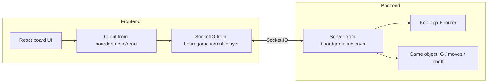

# Multiplayer Tic-Tac-Toe — boardgame.io Implementation Plan

This document outlines steps to build **two projects** (backend + frontend) using **[boardgame.io](https://boardgame.io/)** end to end: same **game object**, **remote game master** (`Server`), **Socket.IO transport**, and optional **Lobby API**. Assumption: standard **3×3 tic-tac-toe** (variants can be expressed later in `moves` / `endIf` / `turn`).

Companion doc: **[BOARDGAME_IO_FIT.md](./BOARDGAME_IO_FIT.md)** (how the engine maps to this repo and what it solves).

---

## 1. Goals (all via boardgame.io)

| Goal | boardgame.io mechanism |
|------|-------------------------|
| Authoritative rules | **Game master** runs your **moves** on the server; clients may **optimistically** mirror them ([multiplayer](https://boardgame.io/documentation/#/multiplayer)). |
| Real-time sync | Default **Socket.IO** transport between `Client` and `Server`. |
| Two projects | **`Server`** (`boardgame.io/server`) + **`Client`** (`boardgame.io/react` or `boardgame.io/client`). |
| Rooms / identity | **`matchID`** (and default `'default'`) or **Lobby REST API** + **`playerCredentials`**. |
| One source of truth for rules | Single **game** export: `setup`, `moves`, `turn`, `endIf`, etc. ([Game API](https://boardgame.io/documentation/#/api/Game)) — ideally **shared** between backend and frontend. |

---

## 2. Architecture (boardgame.io components)



- **`boardgame.io/server` — `Server({ games, origins, db?, ... })`**: hosts the **game master**, Socket.IO, and (by default) the **Lobby REST API** on the same port unless `lobbyConfig.apiPort` splits it ([Server API](https://boardgame.io/documentation/#/api/Server)).
- **`boardgame.io/react` — `Client({ game, board, multiplayer })`**: wraps Redux + transport; **board** receives **`G`**, **`ctx`**, **`moves`**, **`events`**, **`playerID`**, **`matchID`**, **`isActive`**, **`isConnected`**, etc. ([Client / Board props](https://boardgame.io/documentation/#/api/Client)).
- **State model**: your data lives in **`G`** (JSON-serializable); turns, current player, game over live in **`ctx`** (and **`ctx.gameover`** when **`game.endIf`** returns a value).

---

## 3. Repository layout

```
ticTacToe/
├── PLAN.md
├── BOARDGAME_IO_FIT.md
├── backend/
│   ├── package.json
│   └── src/
│       ├── server.js          # Server({ games: [TicTacToe], origins })
│       └── game.js            # game = { name, setup, moves, turn, endIf, ... }
└── frontend/
    ├── package.json
    ├── .env                   # VITE_SERVER_URL → boardgame.io server origin
    └── src/
        ├── App.jsx            # Client(...) wrapper, matchID / playerID / credentials
        ├── Board.jsx          # props.G, props.moves, props.ctx
        └── game.js            # import same game as backend, or from shared/
```

**Recommended:** add **`shared/game.js`** (or a tiny workspace package) exporting only the **game object** (no `fs`, no DOM) so **`Server`** and **`Client`** register the **identical** `name`, `setup`, and `moves`.

---

## 4. Backend — boardgame.io checklist

1. **Initialize** Node in `backend/`; align **ESM vs CJS** with how you import `boardgame.io/server`.
2. **Dependencies**: `boardgame.io` (provides `boardgame.io/server`); pin the **same version** as the frontend `boardgame.io` dependency.
3. **Game object** (`game.js`) — boardgame.io **Game API**:
   - **`name`**: e.g. `'tic-tac-toe'` (required when serving multiple games; used by Lobby paths like `/games/{name}/...`).
   - **`setup`**: `({ ctx }, setupData) => G` — e.g. `cells: Array(9).fill(null)`; optional **`validateSetupData`** if Lobby passes **`setupData`**.
   - **`moves`**: e.g. `clickCell: ({ G, ctx, playerID }, id) => { ... }` — enforce **`ctx.currentPlayer === playerID`**, empty cell, then set symbol; on illegal actions return **`INVALID_MOVE`** from **`boardgame.io/core`** (see [tutorial](https://boardgame.io/documentation/#/tutorial)).
   - **`turn`**: e.g. **`{ minMoves: 1, maxMoves: 1 }`** so each player makes one mark per turn; framework advances **`ctx.currentPlayer`** via **`endTurn`** automatically when max moves reached, or call **`events.endTurn`** inside a move if you prefer explicit control (match [tutorial](https://boardgame.io/documentation/#/tutorial) style).
   - **`endIf`**: return **`{ winner: ... }`** or **`{ draw: true }`** when the game ends; result is exposed as **`ctx.gameover`**.
   - **`minPlayers` / `maxPlayers`**: set to `2` for Lobby enforcement ([Game API](https://boardgame.io/documentation/#/api/Game)).
4. **Server bootstrap** (`server.js`):
   ```js
   import { Server, Origins } from 'boardgame.io/server';
   // Server({ games: [TicTacToe], origins: [...] })
   ```
   - **`games`**: array of game objects `[TicTacToe]`.
   - **`origins`**: allow your frontend origin, e.g. **`Origins.LOCALHOST_IN_DEVELOPMENT`** plus production URL ([Server API](https://boardgame.io/documentation/#/api/Server)).
   - **`server.run(port)`** (or `run({ port, lobbyConfig })`).
5. **Storage (boardgame.io)** — default is **in-memory**. For persistence across restarts or multiple processes, pass **`db`** (e.g. **FlatFile** from docs) ([storage](https://boardgame.io/documentation/#/storage)).
6. **Lobby** — no extra “plugin” switch: the **Lobby HTTP API** is part of the server. Use it by calling **`LobbyClient`** from the frontend (`createMatch`, `joinMatch`, …) and passing returned **`matchID`** + **`playerCredentials`** into **`Client`** as **`credentials`**. Optionally customize **`generateCredentials` / `authenticateCredentials`** on **`Server`** for stronger auth ([Lobby API](https://boardgame.io/documentation/#/api/Lobby)).
7. **Extension points**: **`server.router`** is Koa — add health checks or middleware; **`https`** option for TLS ([Server API](https://boardgame.io/documentation/#/api/Server)).
8. **Dev script**: `node --watch src/server.js` or `nodemon`; **`DEBUG=*`** for Socket/Koa logs ([debugging](https://boardgame.io/documentation/#/debugging)).

---

## 5. Frontend — boardgame.io checklist

1. **Scaffold** Vite + React; install **`boardgame.io`** (same version as backend).
2. **Imports**:
   - **`Client`** from **`boardgame.io/react`**
   - **`SocketIO`** from **`boardgame.io/multiplayer`**
   - **`LobbyClient`** from **`boardgame.io/client`** when using Lobby
3. **Env**: **`VITE_SERVER_URL`** = boardgame.io server base, e.g. `http://localhost:8000` (format per [Client API](https://boardgame.io/documentation/#/api/Client): `http[s]://host:port`).
4. **Wrap with `Client`**:
   ```js
   const TicTacToeClient = Client({
     game: TicTacToe,
     board: TicTacToeBoard,
     multiplayer: SocketIO({ server: import.meta.env.VITE_SERVER_URL }),
     loading: YourLoadingComponent, // optional; else "connecting..."
     debug: true, // boardgame.io debug panel (off in production by default)
   });
   ```
5. **Multiplayer props** (React): pass **`matchID`**, **`playerID`**, and **`credentials`** (from Lobby join) into **`TicTacToeClient`**. Without **`playerID`**, the client is a **spectator** ([multiplayer](https://boardgame.io/documentation/#/multiplayer)).
6. **Board component**: use **`props.G`**, **`props.ctx`** (e.g. **`ctx.currentPlayer`**, **`ctx.gameover`**), **`props.moves.clickCell(i)`**, **`props.isActive`**, **`props.isConnected`**, **`props.matchData`** for player names from Lobby.
7. **Initial state**: with **`SocketIO`**, **`state`** may be **`null`** until sync — guard render or use **`loading`** prop ([multiplayer](https://boardgame.io/documentation/#/multiplayer)).
8. **Local prototyping**: **`Local()`** from **`boardgame.io/multiplayer`** instead of **`SocketIO`** to run two **`Client`** instances in one page without a server ([multiplayer](https://boardgame.io/documentation/#/multiplayer)).
9. **Optional React `<Lobby />`**: from **`boardgame.io/react`**, **`gameComponents={[{ game, board }]}`** + **`gameServer` / `lobbyServer`** URLs ([Lobby client](https://boardgame.io/documentation/#/api/Lobby)).
10. **Vite proxy**: optional; helps same-origin dev while **`origins`** still allows your Vite port.

---

## 6. Integration — boardgame.io-specific

| Item | Requirement |
|------|-------------|
| **`game.name`** | Same string on server **`games: [game]`** and client **`game: TicTacToe`**. |
| **`G` / `ctx` contract** | Board reads the same **`G`** the server’s **`moves`** mutate. |
| **`boardgame.io` version** | Lock the **same** version in backend and frontend `package.json`. |
| **`matchID`** | All players in one match share one id; **`'default'`** if omitted. |
| **Lobby matches** | **`createMatch` → `joinMatch` → pass `credentials`** to **`Client`** so moves are accepted ([Lobby](https://boardgame.io/documentation/#/api/Lobby)). |
| **CORS** | **`origins`** (and **`apiOrigins`** if different) must include the frontend origin ([Server](https://boardgame.io/documentation/#/api/Server)). |

---

## 7. Phases (each step names boardgame.io pieces)

**Phase A — Game + Server**

1. Implement **`game.js`**: **`setup`**, **`moves`**, **`turn`**, **`endIf`**, **`name`**, **`minPlayers`/`maxPlayers`**.
2. **`Server({ games, origins }).run(PORT)`**; verify with **debug UI** or second tab + same **`matchID`**.

**Phase B — Client + SocketIO**

3. **`Client` + `SocketIO` + `board`**; two tabs with distinct **`playerID`** (`'0'` / `'1'`) and shared **`matchID`**.
4. Handle **`loading` / null state**; show **`ctx.gameover`**.

**Phase C — Lobby (boardgame.io)**

5. **`LobbyClient.createMatch` / `joinMatch`**; store **`credentials`**; optional **`<Lobby />`** or custom UI calling the same REST routes.

**Phase D — Hardening**

6. Production **`origins`**, HTTPS, optional **`db`**; **`isConnected`** UX; README with env vars.

---

## 8. Deliverables

- [ ] Backend: **`Server`** runs; **`games`** includes tic-tac-toe; **`endIf`** sets **`ctx.gameover`** on win/draw.
- [ ] Frontend: **`Client`** + **`SocketIO`** connects; board uses **`moves`** / **`G`** / **`ctx`** only (no parallel game state).
- [ ] Two **`playerID`**s complete a match (win + draw paths).
- [ ] Same **`boardgame.io`** version both sides; documented **`VITE_SERVER_URL`** and **`origins`**.

---

## 9. Decisions before coding

1. **Package manager** (npm / yarn / pnpm) — one for both projects.
2. **`shared/` game module** vs duplicated **`game.js`** (shared strongly recommended).
3. **Match flow**: raw **`matchID`** (URL) only vs **Lobby API** + **credentials**.
4. **`db`**: in-memory vs **FlatFile** / other adapter for persistence.

---

## 10. Next step

Execute **Phase A**: add **`backend/src/game.js`** (full **boardgame.io** `game` object) and **`backend/src/server.js`** (**`Server`**, **`Origins`**), then **Phase B** (**`Client`**, **`SocketIO`**, **`Board`**).

If you confirm §9, implementation can proceed without rework.
